## `wifi: YGuest`

---


Hi! I'm Dave.

^ Hi, I'm Dave. I work at Yahoo on the Finance iOS app. I've been at Yahoo for a year and a half now, and have had a chance to do some wonderful things. It also means that I've been here long enough to break things wonderfully, or you know, be near things when they happened to break.

---

#The hard lessons


^ What I have for you today is 4 cases from the last year in which we learned (or re-learned) some important things from failing in different ways. I think that the lessons we learned are important enough to share with you and were kind of fun for us, now that we can look back at it.

---

#everybody fails


^ One thing I want to get out in the open quickly, and hopefully we can agree on it, is that we all fail. As developers we fail on smaller levels several times a day. Xcode says my code is invalid. Our CI server flags me for breaking tests. My peers point out oversights when I send out a PR.

^ I don't view these as bad things. It's all part of the process. What I want to talk about today are the larger times when something fails and you don't really appreciate what you learned from it until you take a step back and reflect on what happened.

^ This type of reflection is quite common in our industry. A lot of teams will have a retrospective, where they look back on the last sprint and reflect on how it went and what they could change. For a technical failure, we would usually use the phrase "post mortem" to describe the reflection process.

---

## Post Mortem
### ⏰ 👣
### 🕵 / 🏥 / 🛠
### 👎👍

^ A lot of people may be familiar with this, but probably not everybody. So, I'll go through the parts of it that I consider important.

^ Some things that are common to post mortems are: a timeline, a step by step breakdown of what happened, how it was detected/diagnosed/fixed, what went right, and what went wrong.

^ This should lean towards being fact based instead of opinion based. That step comes next. So, having all of this data will help you to answer two top level questions.

---

## How can we lower the likelyhood of this?
## How can we minimize the impact?

^ These questions really can be broken down into sub questions that utilize the data that was mentioned on the last slide. So, when looking at how to minimize impact, the questions will be things like "how could we have detected this faster?", "were there gaps in our logging that made it hard to diagnose?", "are there tools that would make it easier to diagnose?", "can we detect this error in development or beta instead of production?"

---

### Do not blame people
#### but you can blame process


^ One note, I think the term post mortem is a bit morbid and negative, so think of it as a retrospective. Now that sounds more like something that we can learn from and less like somebody needs to be blamed. We already do retrospectives at the end of each sprint, and it's definitely not a place to blame people, but a place to ask, "How can we improve our process?"

---

### Don't rush it.
### Wait until you know.


^ My one and only tip for an effective post mortem...

^ Don't do it too soon. Make sure you take the time to really understand what happened before you tell people how you fixed it and it will never happen again.

^ I'm sure a lot of people do post mortems and retrospectives but, as someone who was a freelancer for years, I never had moments of reflection with my whole team. So, I'm really enjoying the time we spend reflecting on our process and our craft. The more time you spend programming, the more you get comfortable with the mechanical aspects of turning product ideas into code. I find that, as you get comfortable with that, there is a whole level of process above that which is interesting to study.

---

#Oopses

^ Now, let's jump into some specific issues that we ran into in the last year or so and do a few mini post-mortems.

---

### 1: Remote App Config

^ The first example I wanted to walk through is not about the Finance app, but about another app at Yahoo. All of our apps use a configuration system that allows us to remotely enable/disable feature flags in apps. It's also used for A/B testing some of those same flags in small buckets.

---

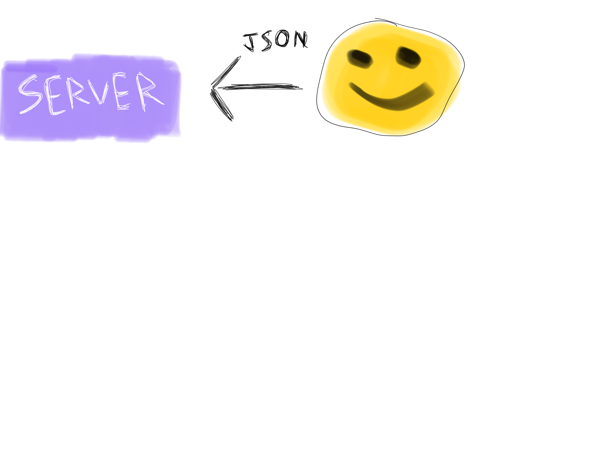

---

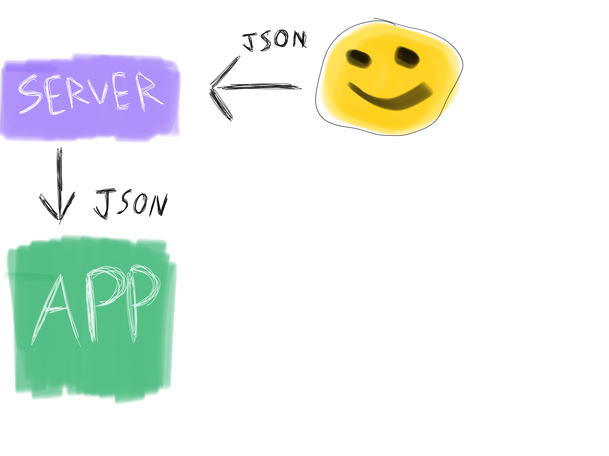

---

```javascript
{
    "baseURL": "http://api.verizon.com/v2/",
    "pollingMaxRetries": 3,
    "prodDebugEnabled": true
}
```

---

```objc
- (NSInteger)pollingMaxRetries
{
    NSString *key = @"pollingMaxRetries";
    NSNumber *num = self.config[key] ?: self.defaults[key];
    return [num integerValue];
}
```

---
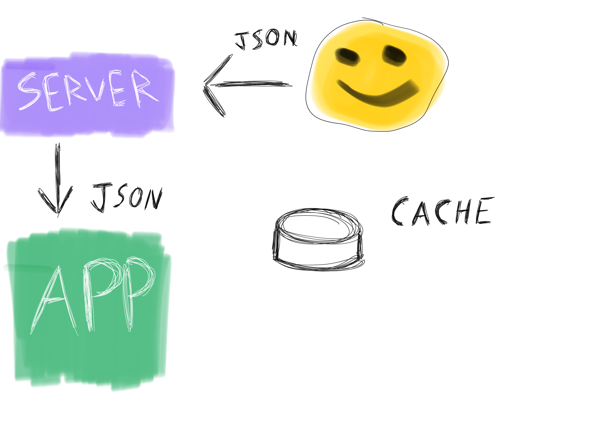

---
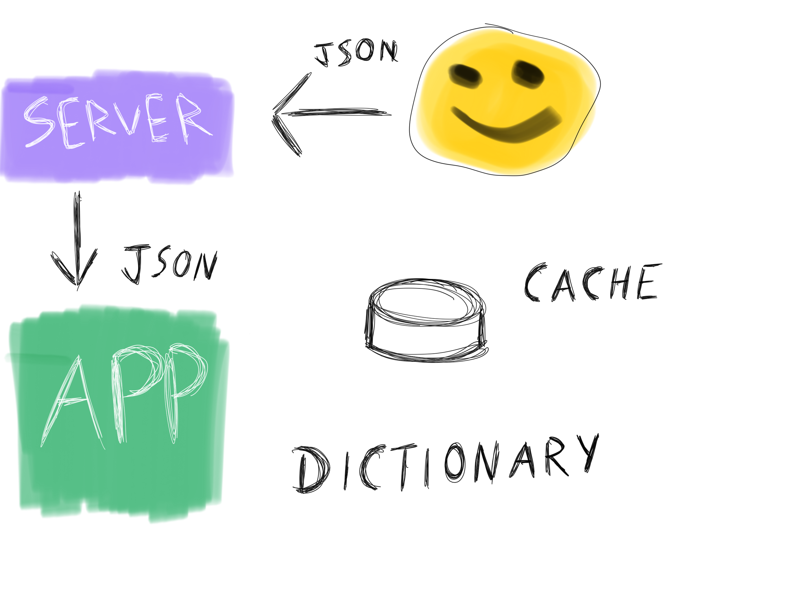

---
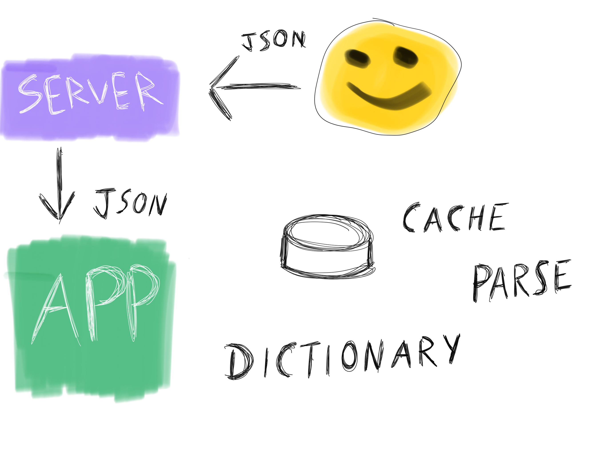

---
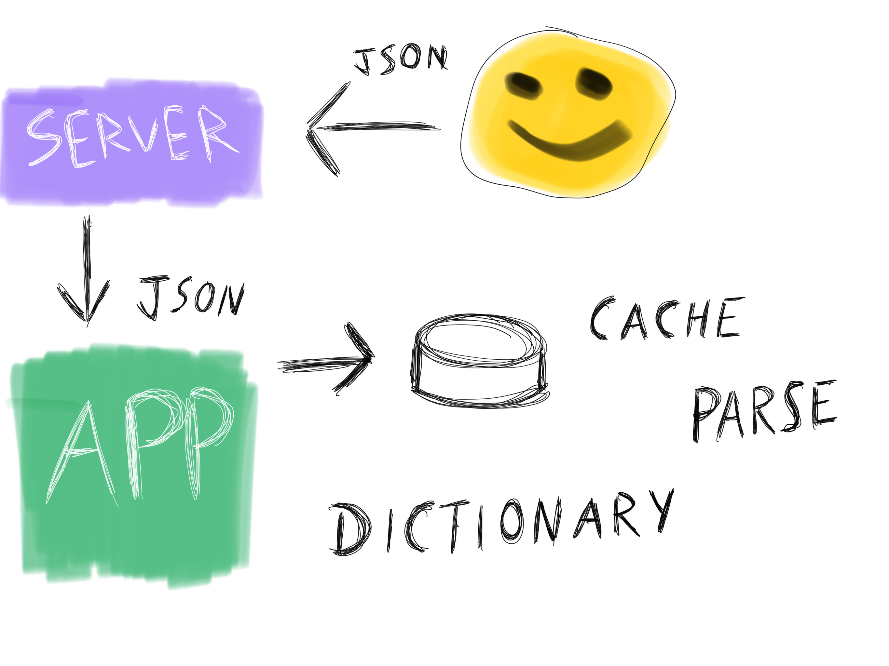

---
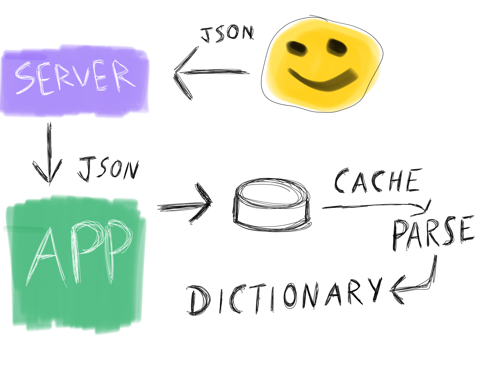

---


---
###Then one day...

---

```javascript
{
    "baseURL": "http://api.verizon.com/v2/",
    "pollingMaxRetries": 3,
    "prodDebugEnabled": true
    "enableSecretFeature": true
}
```

^ That day, somebody forgot to put a comma in the JSON and hits "save".

---

### API traffic way down
### no crash reports

---


---

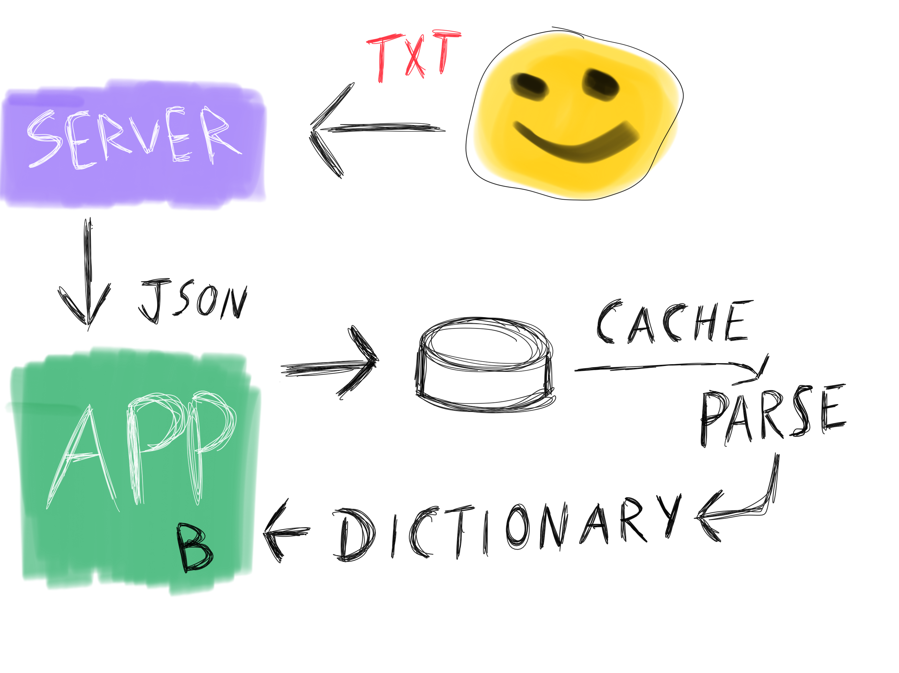

^ It turns out that the server does not validate the JSON when you hit "save".

---


^ So, now we have the server returning invalid JSON.

---

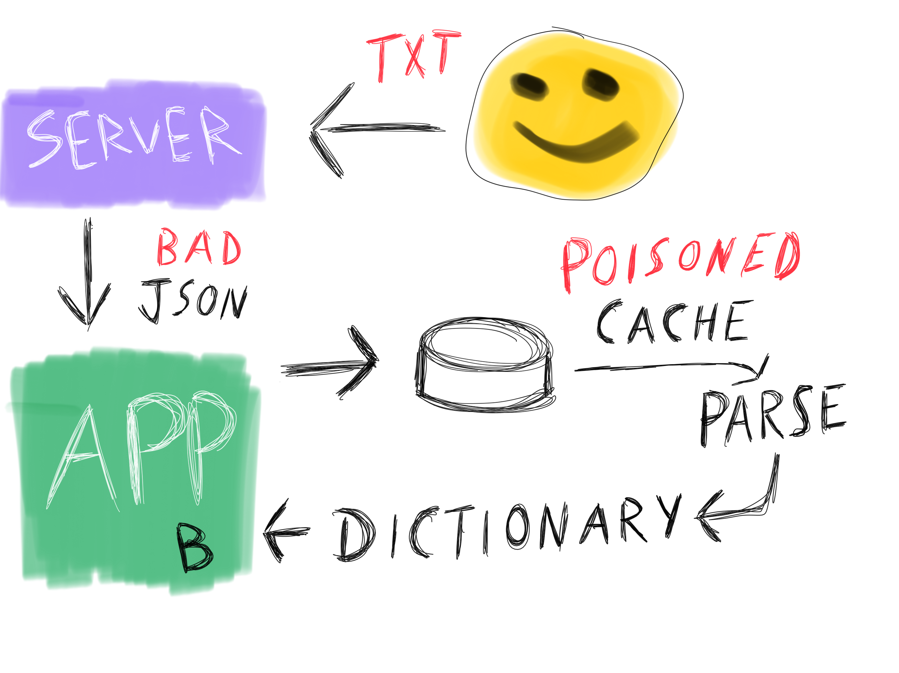

^ Which the app then caches.

---

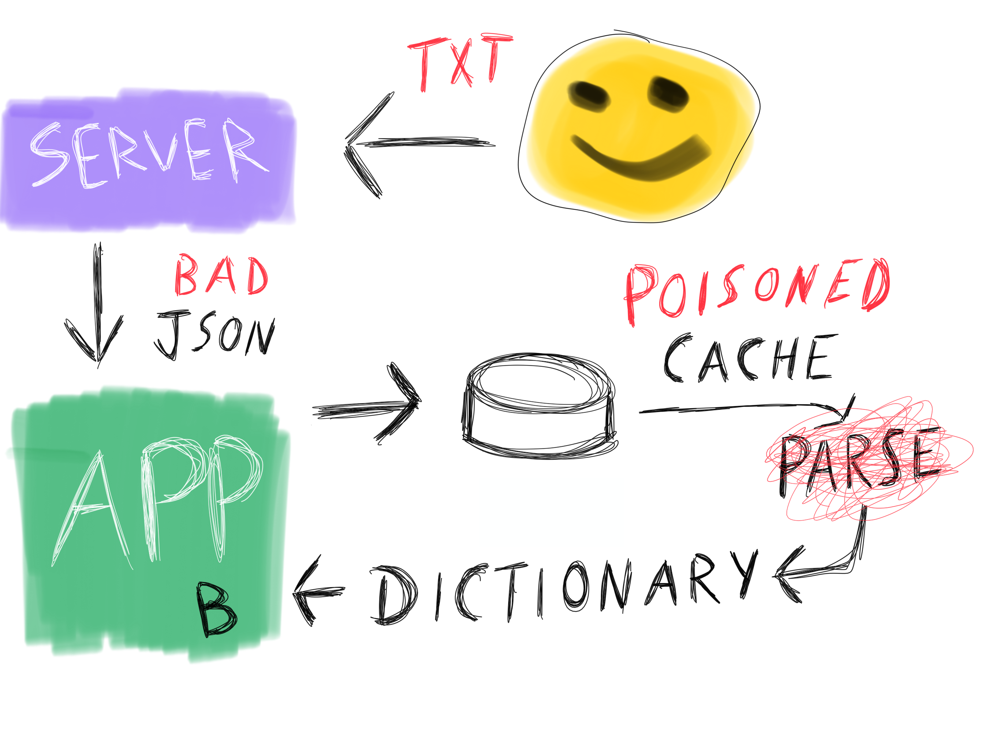

^ Right before it crashes.

^ And, now we have a case where after crashing...the app is relaunched and the app delegate tries to read the JSON from disk and crashes immediately.

---

## What happened?
## Where was the failure?

^ You could point to a number of places and say that this problem could have been prevented. Well, we can go step by step and say that.

---


^ 1 - The server should validate JSON when saving

---


^ 2 - The sever should not send invalid JSON

---


^ 3 - The app should not persist invalid JSON

---
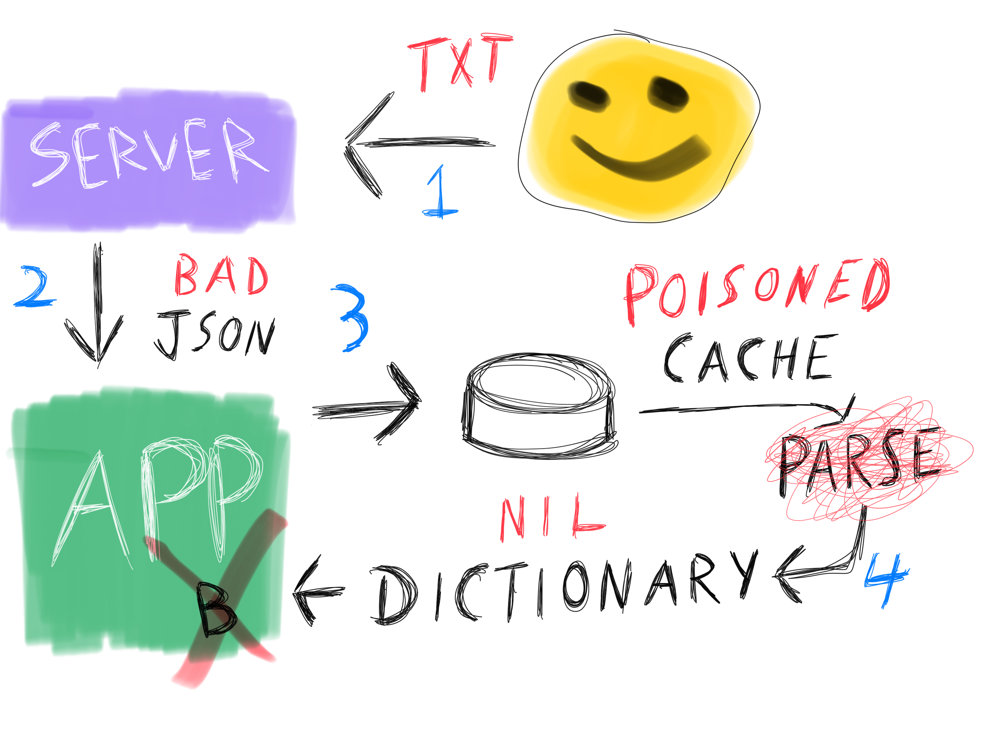

^ 4 - The app should be able to handle invalid JSON

^ Besides pointing at a lot of individual issues, there's the general pattern that invalid data was propagated through the system to a point where it became unrecoverable.

---

### Postel's Law


^ In the 1970's, a man named Jon Postel was writing the RFCs of the protocols that came to define the Internet. Things like IP, ICMP, and TCP. He thought long and hard about this type of problem, and summarized it by saying that "be liberal in what you accept and conservative in what you send." This is often referred to as the Robustness Principle, or even just Postel's Law. The idea is that, on the Internet, there will be bad actors that try to purposely send you malformed data, and there will also just be bugs that send you malformed data. By accepting whatever people send you, you make your own system more robust. By not sending bad data out to other people, you make the entire system more robust. It's kind of a commentary about how to be a good citizen on the network.

^ In our case, the server should be conservative in validating the JSON when the user hit "save". The client should be ready to accept anything sent to it, but should be able to validate the JSON before using it an also probably before caching it.

---

> Be conservative in what you send, be liberal in what you accept.

---

Fixed:

- Server does validation
- parser handles JSON failure
- detect and delete poisoned cache
- client sends telemetry when parsing fails

^ In the end, I believe all of those individual things were fixed.

---

### 2: `identifierForVendor`

^ Or, as I call it, "that time we lost a bunch of user data and then it came back."

^ Is anybody familiar with the `identifierForVendor`? That's good. I expected like 2 hands. When Apple took away access to the UDID of the phone, they gave us two replacements. An identifier for advertisers, that could be used to track behavior for targeting ads. Users could opt out of that, or reset the identifier in the OS settings. 

^ The IDFV is an identifier that is generated when a user installs an app by a specific vendor (like Yahoo or Facebook or Zynga). When a second app is installed by the same company, that same identifier is used.  The identifier remains the same until all the apps from that vendor are uninstalled.

---

> The value in this property remains the same while the app (or another app from the same vendor) is installed on the iOS device. The value changes when the user deletes all of that vendor’s apps from the device and subsequently reinstalls one or more of them.

- The Docs

^ We saw a way that this could be beneficial to us and our users. We read the docs, and followed what they said.

---

```objc
- (NSString *)idForAnonymousUser
{
    return [UIDevice currentDevice].identifierForVendor;
}
```

^ The Finance app supports using it without being logged into Yahoo. Anybody can create a watchlist and track stocks. For performance reasons, we persist that watchlist on the server. It makes it a lot easier to customize the news if we don't have to upload the watchlist as part of every request.

---

###  interesting API + clever = GENIUS

#### (Foreshadowing)

---

### Version 2.3.10 released

^ Start getting reports of users losing their portfolios. Like lots of users. Users do not react well to losing data. Eventually, by looking at server logs, we determine that for some large percentage of users who are not logged in, the `identifierForVendor` is changing. 

---

### Logged out users missing data
### IDFV changed !!

---

### Create a client side fix
### Create a server side fix
### File 2 rdars
### Expedited review

---

### Version 2.3.11

---

### Logged out users data is back
### Except for the ones we "fixed"

---

###  opaque API + "clever" = YOLO
    
    

---

The Fix

```objectivec
- (NSString *)idForAnonymousUser
{
    if (![YFUserDefaults anonymousId]) {
        [[YFUserDefaults setAnonymousId:[NSUUID UUID].UUIDString];
    }
    return [YFUserDefaults anonymousId];
}
```

---

### Understand Dependencies


^ If it looks like magic (or a black box), then don't assume to know how it will behave.

---

### Apple is our biggest dependency


^ The lesson here is to scrutinize your dependencies in terms of risk and reward. We all know this on some level, but it's worth saying out loud occassionally, "Apple is our largest dependency. By far."

---

### 3: Finance 3.0.0 release

^ This is a weird one for me. We did a major new feature over the past several months. I say major. This is what it looked like to our users..we renamed "portfolio" to "watchlist" and moved this button from here (tab bar) to there (watchlist selector). No biggie. Internally, we rewrote about a third of the app to support that. Different API, different models, different persistance, and different assumptions in a ton of views.

---


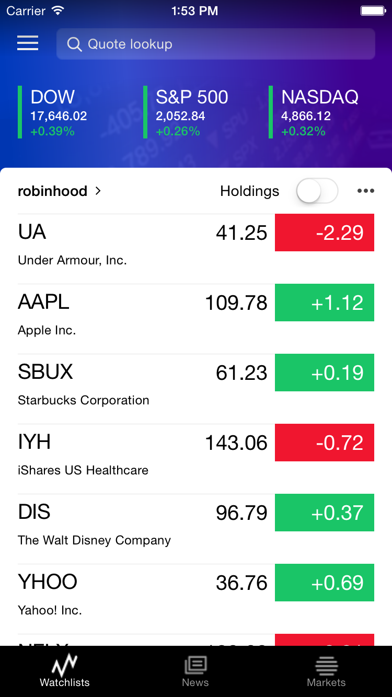

---


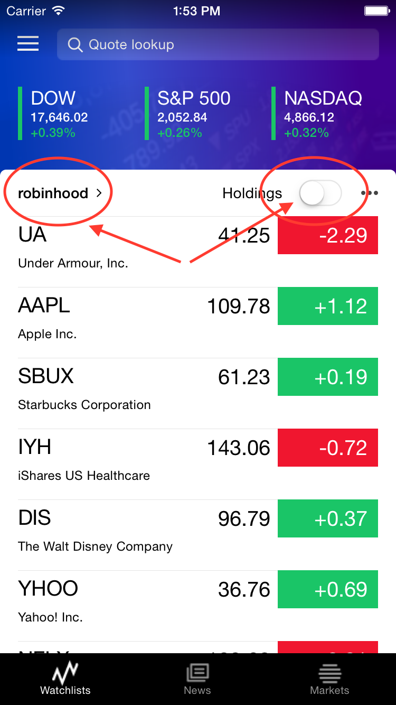

---


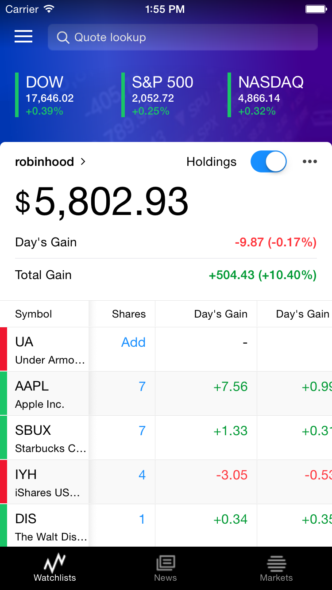

---

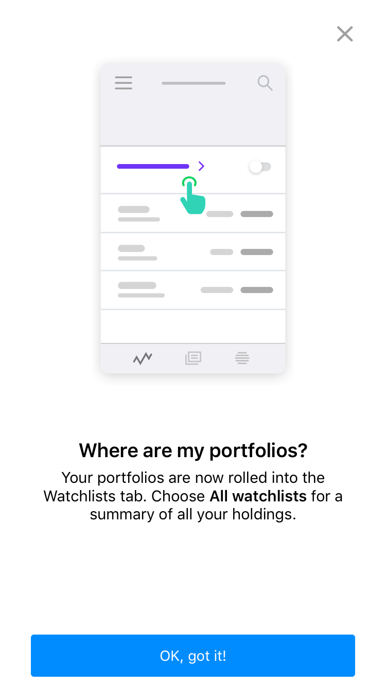

---

### Technically solid
#### Lowest crash rate / Fastest cold start

---

### 1000 :star: reviews

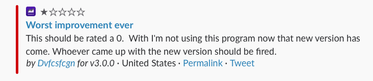

---

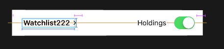

---

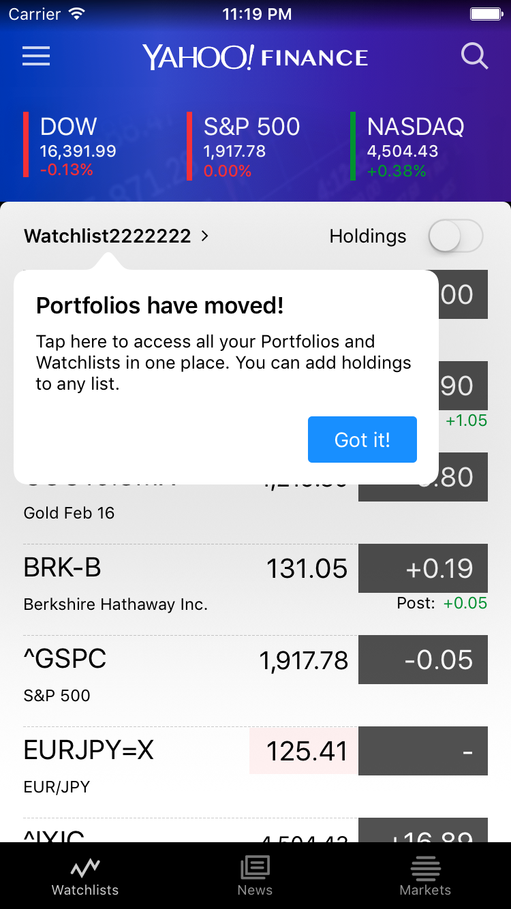

---

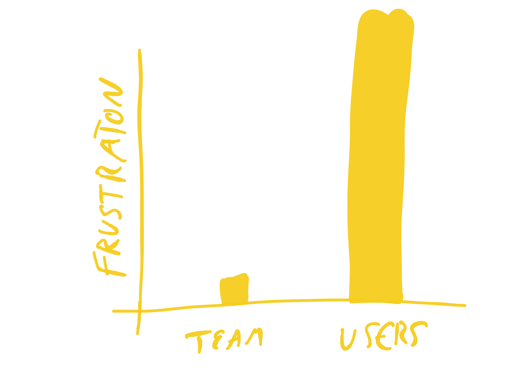

---


---

Fixes:

- Be aware of minor frustrations from team users
- Get all three parts in important meetings/decisions
- Design and Tech basically do pair coding

---

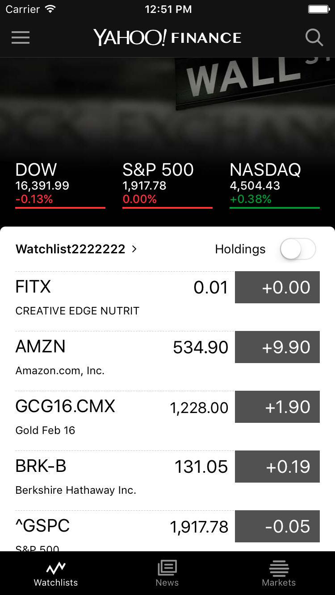

#Why no data?

---


#Market is closed on holidays

---

### robustness
### understand dependencies
### listen to the team

^ So, we've gone through 3 different scenarios that our team ran into in the last year. Y

^ Ultimately, these retrospectives are moments for your team to codify culture and norms...and establish future expectations. These are things that occasionally get reduced to a single phrase or name.

---

## The bigger lessons


^ All of the hardest lessons come down to a single lesson. We don't fully understand the things we build. We don't fully understand the people who use our apps. And we don't fully understand the infrastructure we use to build our apps.

^ Building simple software is the only way to increase our ability to understand things. This is why we're always coming up with new tools to make things simpler to use and easier to understand.

---


## I have no idea what I'm doing

---

### Learning from fails


^ As long as you are willing to learn from your fails, it only gets better.

---


Thanks!


